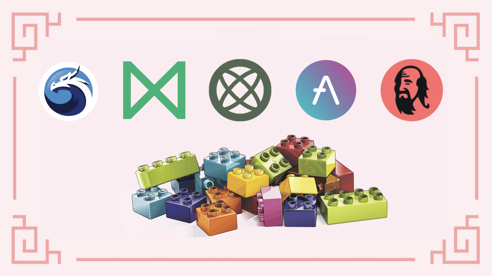
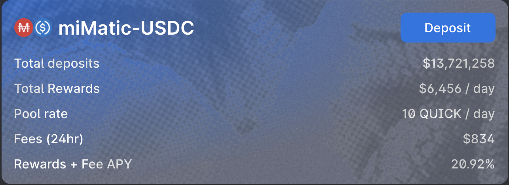
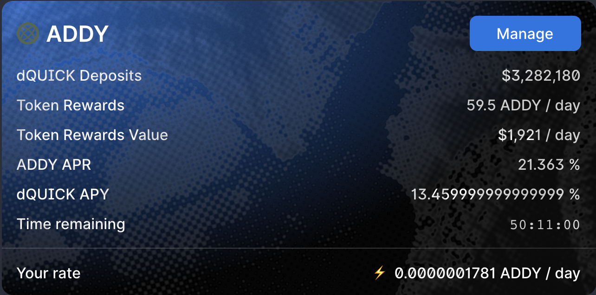
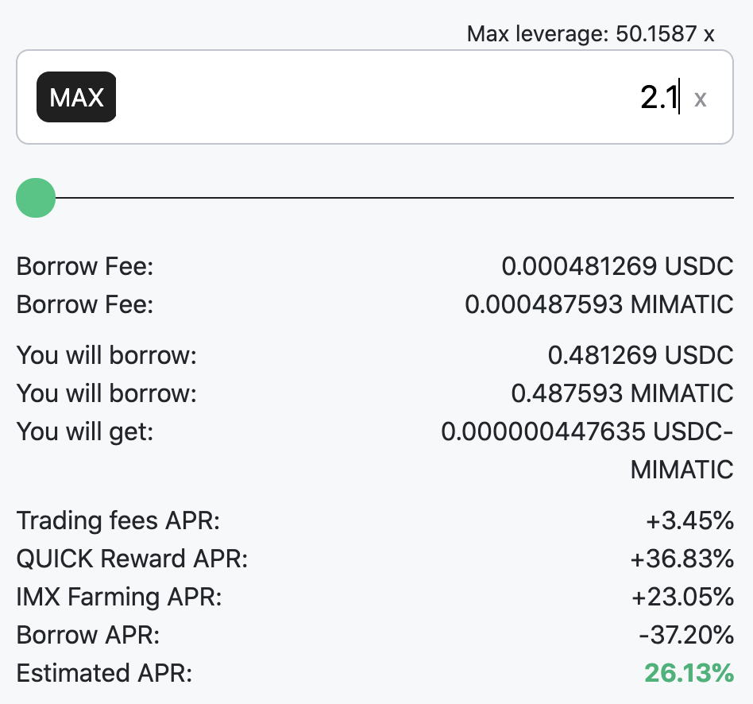
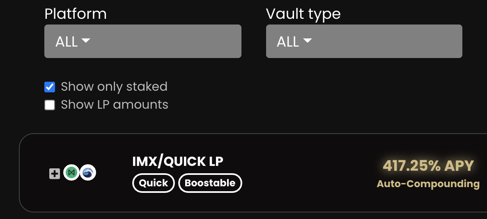
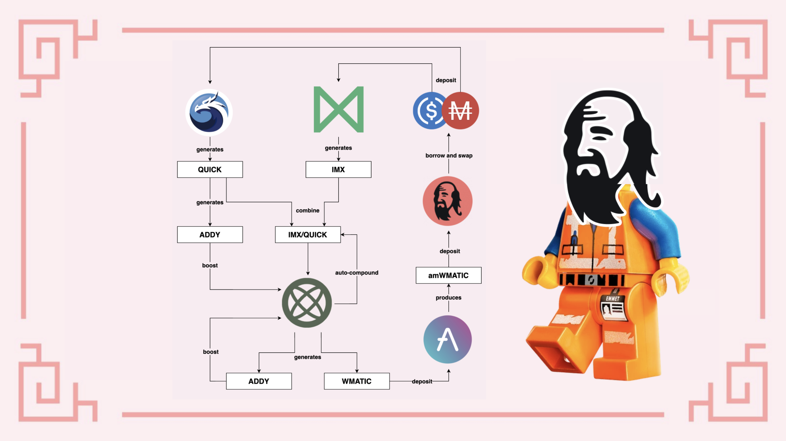

# Impilare le dApp come mattoncini Lego

## Impermax è un'applicazione che consente all'utente di sfruttare automaticamente i propri asset per amplificare le proprie posizioni in pool di liquidità. Questo viene fatto prendendo in prestito risorse aggiuntive fornite sulla piattaforma Impermax.Introduzione

Quando fai farming in una farm, di solito ricevi ricompense sotto forma di token nativi della farm stessa. Hai quindi la possibilità di scegliere se venderli o tenerli e sperare che guadagnino valore nel tempo. Questa guida presenterà alcune DApp \(Applicazioni decentralizzate\) che ti permetteranno di massimizzare i tuoi rendimenti senza vendere nulla pur continuando a far crescere la rendita. Questo articolo partirà dalle stable coin, perché sono l'ideale per una strategia relativamente sicura. Tuttavia, è necessario ricordare che questo non è un consiglio finanziario e che questa guida deve essere seguita con cautela poiché i risultati non sono assolutamente garantiti. Come sempre, fai le tue ricerche.

## QuickSwap

QuickSwap è uno dei più grandi AMM \(Automated Market Maker\) su Polygon. Gli utenti depositano coppie di token in pool di liquidità e guadagnano commissioni di transazione da altri utenti che utilizzano la piattaforma per scambiare i propri token. Durante uno swap, QuickSwap sceglie automaticamente il percorso migliore utilizzando i diversi pool di liquidità e ogni passaggio da un pool all'altro è soggetto a commissioni di transazione che vengono ridistribuite ai fornitori di liquidità.

### Stable coin farming

Per questo esercizio utilizzeremo la coppia MAI/USDC su QuickSwap. Questo pool di liquidità, un pool di stable coin, propone un APY \(Annual Percentage Yield che varia tra il 20% e il 25%\). Il rendimento è composto dalle commissioni di transazione \(che maturano nel pool di liquidità\) e dai premi QUICK.

Il pool riceve una quantità fissa di token QUICK ogni giorno, che vengono quindi distribuiti ai fornitori di liquidità in base alla loro quota nel pool. Ad esempio, se il pool ha l'equivalente di $1.000.000 di liquidità e hai già depositato $1.000 di token LP \(Liquidity Provider\), possiedi lo 0,1% del pool, che ti dà diritto allo 0,1% del premio QUICK giornaliero. La tua ricompensa in QUICK sarà quindi riscattabile direttamente dal pool in cui hai depositato.

Puoi riscattarli regolarmente per reinvestirli. Vediamo come:

### Dragon's Lair

Il Dragon's Lair è un modo per ottimizzare i tuoi guadagni su QuickSwap. Puoi depositare i token QUICK che guadagni dai pool di liquidità nel "Lair" e ti guadagnerai ulteriori ricompense in QUICK. Questa è una buona idea se vuoi detenere i token QUICK invece di venderli. Quando i tuoi token QUICK vengono depositati nella Dragon's Lair le ricompense generate vengono automaticamente sommate e l'APY del Lair è di circa il 12%.

Dopo aver depositato i tuoi token QUICK, otterrai nel tuo portafoglio alcuni token dQUICK che rappresentano la tua quota del pool QUICK. Nota che il rapporto QUICK:dQUICK non è 1:1 poiché dQUICK rappresenta la tua quota del pool mentre la quantità di QUICK aumenterà nel tempo man mano che vengono aggiunte più ricompense al pool.

Ora hai le tue stable coin depositate nel pool di liquidità che generano ricompense in QUICK. Le ricompense stanno a loro volta generando più ricompense grazie al Dragon's Lair. Ma aspetta, c'è di più...

### Dragon's Syrup

Il Dragon's Syrup è un ulteriore modo che QuickSwap offre per premiare ancora di più gli utenti che detengono token QUICK. Il team QuickSwap ha creato un programma per cui i partner possono promuovere i propri prodotti concedendo il proprio token agli utenti della piattaforma QuickSwap. Puoi quindi depositare i tuoi token dQUICK in una delle farm per guadagnare questi token "esotici" in aggiunta alle ricompense di Dragon's Lair. Quello che ci interessa è la farm ADDY.

Quando depositi i tuoi dQUICK nella farm, scompariranno dal Dragon's Lair \(più o meno allo stesso modo in cui i tuoi CamToken scompaiono dalla pagina Yield su Mai Finance quando li depositi in un Vault\). Ma puoi vedere chiaramente che l'APY di dQUICK dal Lair è ancora presente e che otterrai anche una ricompensa aggiuntiva ADDY. Qui, l'APR \(premio percentuale annuale\) è attualmente del 21,36%.


Noterai che le farm Dragon's Syrup hanno una data di scadenza. In questo caso, la farm ADDY scadrà tra 50 giorni e 11 ore. Alcune nuove farm appariranno mentre alcune più vecchie scompariranno.


Nel nostro caso, le ricompense ADDY che otteniamo possono essere riscattate manualmente. Si può notare che il ritmo con cui riscatteremo le ricompense ADDY può solo accelerare se reinvestiamo manualmente le ricompense QUICK in dQUICK da depositare nella farm ADDY di QuickSwap.

### Riassunto veloce

Abbiamo i token MAI/USDC LP depositati nel pool di liquidità e guadagniamo:

* commissioni dalle fee di swap
* ricompense in QUICK dal pool che dobbiamo riscattare manualmente ed aggiungere nel Dragon's Lair
* ricompense in QUICK dal Dragon's Lair che vengono reinvestite automaticamente
* ricompense in ADDY dal Dragon's Syrup che possiamo riscattare

## Impermax

Impermax è un'applicazione che consente agli utenti di sfruttare automaticamente i propri asset per amplificare le proprie posizioni in pool di liquidità. Questo viene fatto prendendo in prestito risorse aggiuntive fornite sulla piattaforma stessa.

### Stable coin farming

Per questo esercizio utilizzeremo il pool MAI/USDC su Impermax. Depositando alcuni token LP nel pool MAI/USDC abbiamo la possibilità di sfruttare questo deposito un certo numero di volte per aumentare il nostro capitale ottenere più ricompense. Quando si utilizza Impermax è però necessario porre attenzione ad alcuni aspetti importanti:

* Puoi prendere in prestito solo ciò che altri utenti hanno depositato
* Più assets vengono presi in prestito più è alto il tasso di prestito
* Se il tasso di prestito diventa troppo alto, il tuo APR finale può diventare negativo e quindi perderai parte del tuo LP
* Maggiore è la leva usata, più alto è l' APR ma più alto è il tasso di prestito

### Posizioni in leva

Su QuickSwap ho depositato $20 di MAI/USDC. Su Impermax, deposito solo $10 di MAI/USDC e applicherò una leva x2 per ottenere un'esposizione di $20.

Potete notare dallo screenshot qui sopra che se aumentassi la mia leva a x2.1 prenderei in prestito:

* 0.481269 USDC
* 0.487593 MAI

Possiamo anche notare quanto aumenterebbero le commissioni di trading che raccoglierei \(+3,45%\), così come l'aumento delle ricompense QUICK \(+36,83%\), delle ricompense IMX \(+23,05%\) e del tasso di prestito \(-37,20%\) per un APR finale stimato del 26,13%.

Vi faccio notare anche che in questo esempio le commissioni di prestito verrebbero pagate utilizzando le ricompense QUICK e le commissioni di trading nel caso in cui le ricompense QUICK non siano sufficienti. La ricompensa in IMX andrà al fornitore se la commissione di prestito non è stata ancora pagata e infine il deposito verrà utilizzato per pagare il fornitore se c'è ancora qualcosa di insoluto.

Il nostro obbiettivo è eguagliare il deposito che abbiamo su QuickSwap, quindi ci fermeremo ad una leva x2. Ciò garantirà anche di non correre il rischio di ottenere APR negativi. Il nostro obbiettivo non è raccogliere più ricompense possibili ma aumentare la nostra posizione nel tempo e riscattare token IMX.

### Riassunto veloce

Abbiamo i token MAI/USDC depositati nel pool appropriato

* La nostra posizione viene messa in leva X2 per eguagliare l'importo depositato in QuickSwap
* Otteniamo token IMX

## Adamant

Adamant è una piattaforma di ottimizzazione di rendimenti che automatizza il riscatto dai pool di liquidità e li reinveste in token LP aggiuntivi. La maggior parte dei pool presenti su Adamant sono pool famosi di grandi fornitori di liquidità come QuickSwap, SushiSwap e altri. Vediamo come sfruttare Adamant per ottimizzare i nostri rendimenti.

### Farm di QUICK/IMX

Stiamo guadagnando token QUICK su QuickSwap e token IMX su Impermax. Possiamo quindi usare Adamant per farmare nel pool QUICK/IMX da QuickSwap. Perché farlo? Perché la farm è molto redditizia, come possiamo vedere qui:

Alla stesura di questo articolo,  l' APY del pool IMX/QUICK su Adamant è del 417,25%. La ricompensa è composta da:

* 168.49% su QUICK reinvestiti automaticamente \(le ricompense QUICK da QuickSwap vengono vendute per acquistare token LP IMX/QUICK addizionali che vengono aggiunti alla tua posizione\)
* 212.85% sugli ADDY riscattabili su Adamant \(questi rimangono bloccati 90 giorni quindi non sono accessibili subito\)
* 35.91% sulle commissioni pagati in WMATIC se riscatti i tuoi ADDY quotidianamente

Ciò significa che la tua posizione IMX/QUICK aumenterà nel tempo e che otterrai ricompense in ADDY. Più ADDY detieni, maggiori saranno i dividendi \(in WMATIC\) che otterrai.

Come puoi notare l'APY su Adamant può avere un ulteriore boost. Ciò significa che se depositi ulteriori token ADDY \(non quelli acquisiti\), si applicherà un moltiplicatore aggiuntivo alle ricompense che otterrai. E questa è davvero una buona cosa, perché otteniamo ulteriori token ADDY dal Dragon's Syrup su QuickSwap!

### Riscattare ADDY e WMATIC

Quando riscatti gli ADDY guadagnati dalla tua posizione LP nel pool IMX/QUICK, questi saranno bloccati per 90 giorni ma ti permetteranno di ottenere dei dividendi sotto forma di WMATIC. L'attuale APR per i dividendi è del 34% sui tuoi token ADDY.

Dopo il periodo di blocco \(vesting\) di 90 giorni, avrai la possibilità di bloccarli di nuovo per almeno altri 90 giorni al fine di aumentare i token ADDY guadagnati dai vault e guadagnare token ADDY aggiuntivi.

I dividendi WMATIC sono l'output effettivo del trio QuickSwap + Impermax + Adamant che stiamo cercando, perché saremo in grado di usarli per reinvestire token LP aggiuntivi sia in QuickSwap che in Impermax.

### Riassunto veloce

Depositiamo i token IMX e QUICK guadagnati da Impermax e QuickSwap sotto forma di token LP IMX/QUICK. Adamant ci permette di guadagnare:

* ulteriori token LP grazie al reinvestimento automatico dei token QUICK che ci garantisce QuickSwap per il pool IMX/QUICK
* token ADDY usati per il boost delle ricompense IMX/QUICK e per ottenere i dividendi
* dividendi in WMATIC

## AAVE

I i token WMATIC guadagnati su Adamant possiamo andarli a depositare su AAVE per ottenere un po' di rendimento. Questo è parte della strategia descritta in [questo articolo](https://app.gitbook.com/@qidao-qimps/s/mai-finance-tutorials/~/drafts/-MlEaDNrYCUeSUCreaNT/v/italian/tutorial-di-investimento/far-fruttare-i-tuoi-token-su-aave).

## Mai Finance

Dopo il deposito AAVE, otteniamo amWMATIC nel nostro portafoglio. Possiamo utilizzare la pagina Yield su Mai Finance per unire l'APR base di AAVE con le ricompense in MATIC e ottenere un ulteriore 4% sui nostri MATIC guadagnati su Adamant. 

Il camWMATIC può quindi essere utilizzato come garanzia su Mai Finance depositandoli nel vault camWMATIC che ci consente di prendere in prestito MAI e scambiare una parte del MAI coniato in USDC. Una volta che abbiamo più MAI e USDC nel nostro portafoglio, possiamo combinare le 2 monete stabili in token LP aggiuntivi che verranno depositati su QuickSwap e Impermax. Di nuovo, questo fa parte della strategia già descritta [qui](https://app.gitbook.com/@qidao-qimps/s/mai-finance-tutorials/~/drafts/-MlEaDNrYCUeSUCreaNT/v/italian/tutorial-di-investimento/far-fruttare-i-tuoi-token-su-aave).

## Avvio del sistema

Quella che segue è una simulazione realizzata con un investimento iniziale di $1.000 di token LP MAI/USDC e basato su APR/APY forniti dalle diverse piattaforme al 30 agosto 2021. Questa non è una reale applicazione di quanto descritto sopra. Le tariffe varieranno, i prezzi dei token varieranno, alcuni programmi finiranno ecc... quindi i risultati finali sono solo una stima di ciò che potresti ottenere se tutto rimanesse stabile, altamente improbabile.

### Giorno 1

Dato che abbiamo $1.000 di MAI/USDC, vogliamo dividere i token LP tra QuickSwap e Impermax. Poiché Impermax ci consente di moltiplicare il nostro deposito, possiamo mettere più token su QuickSwap e utilizzare l'opzione di leva su Impermax per pareggiare quelli su QuickSwap.

Al fine di ridurre il rischio di interessi negativi su Impermax, il frazionamento sarà il seguente:

* $900 di MAI/USDC su QuickSwap
* $100 di MAI/USDC su Impermax con leva x9 per un totale di $900 sul pool MAI/USDC

Per il resto della simulazione, considereremo un APR del 25,56% su MAI/USDC pagato in token QUICK \(su QuickSwap e un APR medio del 20% su MAI/USDC a x9 pagato solo in token IMX\(su Impermax\). Ciò corrisponde a una tariffa giornaliera di

* +0.07% su QuickSwap
* +0.05% su Impermax

Ciò significa che alla fine del Giorno 1, abbiamo già raccolto:

* $0.63 di QUICK
* $0.49 di IMX

Ora, possiamo combinare tutti i token IMX che otteniamo con una parte della ricompensa QUICK nella coppia LP IMX/QUICK che depositeremo su Adamant. La coppia LP ha un valore di $0,98 e abbiamo ancora $0,14 di QUICK che depositeremo nel Dragons's Lair per dQUICK. dQUICK verranno quindi utilizzati nel Dragon's Syrup per iniziare a raccogliere ADDY dal Giorno 2.

| Tipo di ricompensa | Valore in dollari |
| :--- | :--- |
| dQUICK su QuickSwap | 0.14 |
| ADDY su QuickSwap | 0 |
| IMX/QUICK su Adamant | 0.98 |
| ADDY su Adamant | 0 |
| WMATIC su Adamant | 0 |
| camWMATIC su Mai Finance | 0 |
| debito su Mai Finance | 0 |

### Giorno 2

Abbiamo ancora la stessa posizione su QuickSwap e Impermax, non è cambiato nulla e ancora una volta otteniamo $0,63 di QUICK e $0,49 di IMX che utilizziamo per ottenere $0,98 di IMX/QUICK e $0,14 di dQUICK depositati nella farm ADDY su QuickSwap..

Tuttavia, la posizione IMX/QUICK su Adamant sta guadagnando il 151.96% di APR in IMX/QUICK \(o +0.42% al giorno\). Ciò significa che il nostro deposito originale di $0,98 è ora a $0,984 e stiamo aggiungendo $0,98 dal farming su QuickSwap e Impermax. Abbiamo anche generato ADDY con un APR del 177,43% \(o +0,49% giornaliero\) corrispondente a $0,005.

Su QuickSwap, il dQUICK che abbiamo depositato nel Dragon's Syrup sta generando token QUICK aggiuntivi al 12,26% di APR \(+0,03% al giorno\) e token ADDY al 17,08% di APR \(+0,05% al ​​giorno\). Questo viene aggiunto al valore di $0,18 di QUICK, il che significa che alla fine del Giorno 2 abbiamo già generato $0,0006 di ADDY e $0,000054 di QUICK. La ricompensa ADDY può essere richiesta e aggiunta in Adamant per iniziare a potenziare l'APR ADDY della posizione IMX/QUICK.

| Tipo di ricompensa | Valore in dollari |
| :--- | :--- |
| dQUICK su QuickSwap | 0.274 |
| ADDY su QuickSwap | 0.00006 |
| IMX/QUICK su Adamant | 1.98 |
| ADDY su Adamant | 0.005 |
| WMATIC su Adamant | 0 |
| camWMATIC su Mai Finance | 0 |
| debito su Mai Finance | 0 |

### Giorno 3

Andando avanti, la ricompensa ADDY riscattata su Adamant ora sta generando ricompense WMATIC. I primi $0,005 di ADDY riscattati guadagnano il 56% di APR \(0,15% al ​​giorno\) di dividendi WMATIC, che corrisponde a $0,000007 di WMATIC. Tieni presente che stiamo giusto avviando il processo a questo punto.

| Tipo di ricompensa | Valore in dollari |
| :--- | :--- |
| dQUICK su QuickSwap | 0.411 |
| ADDY su QuickSwap | 0.00019 |
| IMX/QUICK su Adamant | 2.971 |
| ADDY su Adamant | 0.014 |
| WMATIC su Adamant | 0.000007 |
| camWMATIC su Mai Finance | 0 |
| debito su Mai Finance | 0 |

### Giorno 4

Ora possiamo aggiungere WMATIC nel ciclo. Questo dividendo sarà depositato su AAVE e quindi utilizzato su Mai Finance per prendere in prestito MAI.

| Tipo di ricompensa | Valore in dollari |
| :--- | :--- |
| dQUICK su QuickSwap | 0.548 |
| ADDY su QuickSwap | 0.00038 |
| IMX/QUICK su Adamant | 3.969 |
| ADDY su Adamant | 0.029 |
| WMATIC su Adamant | 0.000029 |
| camWMATIC su Mai Finance | 0.000007 |
| debito su Mai Finance | 0.0000035 |

A questo punto il "debito" su Mai Finance verrà utilizzato per aumentare le posizioni MAI/USDC LP sia su QuickSwap che su Impermax e il ciclo è completamente avviato..

## Risultati del farming

### Routine quotidiana

La routine quotidiana è composta dalle seguenti operazioni

* Riscattare IMX su Impermax
* Riscattare QUICK su QuickSwap
* Reinvestire IMX/QUICK LP su QuickSwap
* Depositare i QUICK rimanenti nel Dragon's Lair per ottenere dQUICK
* Depositare i dQUICK nel Dragon's Syrup per ottenere ADDY addizionali
* Riscattare ADDY nel Dragon's Syrup
* Depositare gli ADDY riscattati nel vault Adamant
* Depositare i token IMX/QUICK LP su Adamant
* Riscattare gli  ADDY su Adamant dalla coppia LP
* Riscattare i dividendi WMATIC su Adamant
* Depositare WMATIC su AAVE e ottenere amWMATIC
* Depositare amWMATIC su Mai Finance e ottenere camWMATIC
* Depositare camWMATIC nel vault Mai Finance
* Prendere in prestito il 50% del deposito in MAI stable coin su Mai Finance
* Scambiare 50% dei MAI per USDC su Mai Finance
* Creare la coppia MAI/USDC LP su QuickSwap
* Depositare il 90% dei nuovi token LP su QuickSwap
* Depositare 10% dei nuovi token LP su Impermax
* Impostare la leva su Impermax in modo che corrisponda alla posizione su QuickSwap

### Risultati mese dopo mese a grandi linee

| Mese | dQUICK | IMX/QUICK | ADDY | WMATIC | Debito |
| :--- | :--- | :--- | :--- | :--- | :--- |
| 1 | $4.25 | $32.56 | $2.32 | $0.03 | $0.02 |
| 2 | $8.36 | $68.34 | $9.65 | $0.28 | $0.15 |
| 3 | $12.48 | $108.86 | $22.30 | $0.98 | $0.49 |
| 4 | $16.59 | $154.78 | $41.34 | $2.41 | $1.20 |
| 5 | $20.71 | $206.83 | $67.50 | $4.86 | $2.42 |
| 6 | $24.84 | $265.83 | $101.73 | $8.70 | $4.34 |
| 7 | $28.97 | $332.74 | $145.11 | $14.31 | $7.15 |
| 8 | $33.12 | $408.63 | $198.87 | $22.14 | $11.06 |
| 9 | $37.29 | $494.73 | $264.40 | $32.70 | $16.34 |
| 10 | $41.48 | $592.45 | $343.28 | $46.57 | $23.26 |
| 11 | $45.71 | $703.39 | $437.33 | $64.40 | $32.19 |
| 12 | $49.97 | $829.37 | $548.59 | $86.94 | $43.46 |

### Giorno 365

Dopo un anno intero, il nostro investimento sarebbe a questo punto:

| Tipo di ricompensa | Valore in dollari |
| :--- | :--- |
| dQUICK su QuickSwap | 50.689 |
| ADDY su QuickSwap | 4.325 |
| IMX/QUICK su Adamant | 851.968 |
| ADDY su Adamant | 568.972 |
| WMATIC su Adamant | 91.209 |
| camWMATIC su Mai Finance | 91.220 |
| debito su Mai Finance | 44.30 |

Nota che WMATIC in Adamant viene raccolto giornalmente quindi non rientra nelle entrate finali generate tramite questo processo. Inoltre,in questa simulazione, l'ADDY che è stato generato tramite la farm QuickSwap non è stato raccolto giornalmente e reinvestito per aumentare le ricompense ADDY su Adamant \(è già abbastanza complesso così\).

Alla fine, dopo un anno, il valore della nostra posizione vale $1.567,174. Se consideriamo che l'investimento iniziale era di $1.000 di MAI/USDC, questo porta ad un APY finale del 156,71% sulla nostra coppia di stable coin.

## Conclusione

Questo giochino "Lego" ci ha permesso di generare un impressionante APY di farming di stable coin, con pochissima esposizione al rischio. Naturalmente, questa simulazione fa alcune assunzioni errate al 100% ma illustra come è possibile combinare diverse DApp per massimizzare la resa da farm. Mostra anche che non è necessario vendere i token che farmiamo e che c'è sicuramente un modo per usarli in modo efficiente se ci si prende il tempo per cercare queste opportunità.

## Disclaimer

Questa guida non è assolutamente un consiglio finanziario, è stata realizzata a puro scopo educativo. Devi prestare attenzione alle variazioni di prezzo, domanda e offerta, date di fine dei programmi di incentivo, impermanent loss ecc...  L' obiettivo non era quello di proporre una ricetta da seguire alla cieca, quindi per favore fai le tue ricerche e le tue simulazioni e investi solo ciò che sei disposto a perdere.


Tieni presente che una strategia che funziona bene in un dato momento potrebbe avere un rendimento peggiore \(o farti perdere denaro\) in un altro. Tieniti aggiornato, monitora i mercati, tieni d'occhio i tuoi investimenti e come sempre, fai le tue ricerche.


