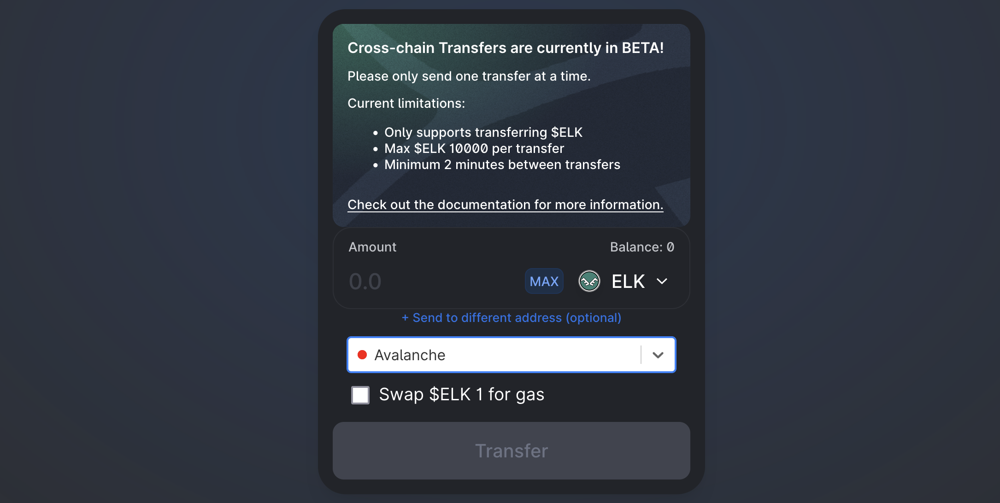
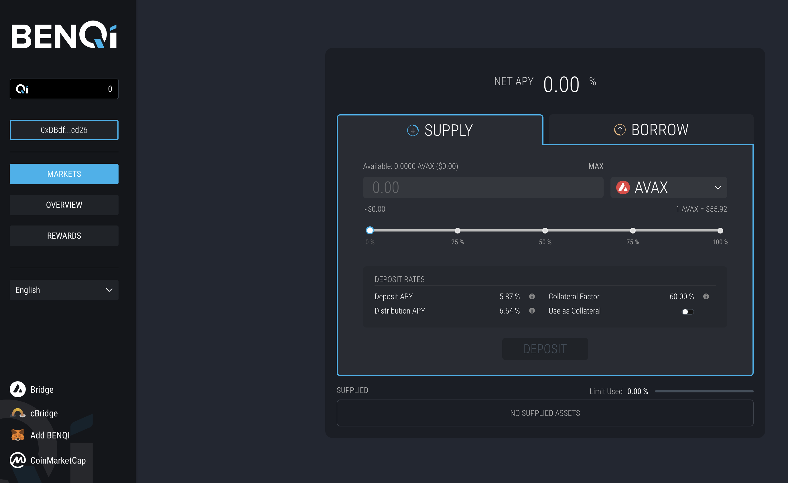

# Hướng dẫn khởi đầu trên mạng Avalanche

## Avalanche là gì?

Avalanche là một blockchain lớp một có chức năng như một nền tảng cho các ứng dụng phi tập trung và các mạng blockchain tùy chỉnh. Mạng Avalanche bao gồm ba chuỗi khối riêng lẻ: Chuỗi X, Chuỗi C và Chuỗi P. Mỗi chuỗi có mục tiêu riêng biệt, hoàn toàn khác với cách tiếp cận của chuỗi với nhau, cụ thể là yêu cầu tất cả các nút xác thực tất cả các giao dịch. Các blockchains Avalanche thậm chí còn sử dụng các cơ chế đồng thuận khác nhau dựa trên các trường hợp sử dụng của chúng.

Avalanche tương thích 100% EVM với chuỗi công cụ Ethereum hiện có và Chuỗi C của nó cung cấp tất cả các chức năng tương tự như Ethereum nhưng với thông lượng cao hơn,  thời gian giao dịch dưới  một giây và phí giao dịch thấp hơn nhiều. AVAX là mã thông báo bản vị của mạng Avalanche.

## Bước đầu trên Avalanche

Trước khi sử dụng mạng Avalanche, bạn sẽ cần tạo một địa chỉ ví. Có thể sử dụng các loại ví khác nhau bao gồm \*\* ví mềm \*\* như Metamask hoặc [Avalanche Wallet](https://wallet.avax.network/access), cũng như \*\* ví phần cứng \*\* như [Trezor](https://trezor.io/coins/) hoặc [Ledger.](https://support.ledger.com/hc/en-us/articles/360020765779-Avalanche-AVAX-?docs=true)

Với mục đích của hướng dẫn này, chúng tôi sẽ sử dụng Metamask. Nếu bạn chưa cài đặt Metamask, bạn có thể tìm hướng dẫn về Cách bắt đầu trên Polygon.

### Adding Avalanche to Metamask

Để sử dụng mạng Avalanche, bạn cần thêm nó vào Metamask. Để làm như vậy, hãy nhấp vào phần mạng lưới trong menu ( Ethereum Mainnet nếu đây là lần đầu tiên bạn thiết lập nó), sau đó chọn RPC tùy chỉnh. Sau đó, bạn có thể thêm các thông số  sau vào biểu mẫu bật lên:

* **Tên mạng lưới**: Avalanche Network
* ** RPC URL**: [https://api.avax.network/ext/bc/C/rpc](https://api.avax.network/ext/bc/C/rpc)
* **Ký hiệu chuỗi**: 43114
* **Biểu tượng**: AVAX
* **Trình khám phá**: [https://cchain.explorer.avax.network/](https://cchain.explorer.avax.network)

Lưu các thay đổi và Metamask sẽ tự động chuyển bạn sang mạng Avalanche.

## Cầu nối đến Avalanche

### Faucets

Hiện tại không có chương trình Faucets nào trên mainnet Avalanche. Nếu bạn cần một số AVAX để trả chi phí gas ban đầu, bạn sẽ phải gửi AVAX trực tiếp đến ví của mình từ một sàn giao dịch tập trung hoặc bằng cách bắc cầu các mã thông báo qua cầu Elknet. Tìm hiểu thêm về tùy chọn thứ hai này trong phần Cầu nối bên dưới.

### Các cầu nối

* [Cầu Avalanche chính thức ](https://bridge.avax.network/login)- Avalanche có cầu riêng có thể được sử dụng để kết nối các tài sản từ mạng chính Ethereum đến Avalanche. Phí gas được thanh toán bằng mã token bắc cầu và có thể cao vì bạn đang bắc cầu từ Ethereum.
* [Anyswap](https://anyswap.exchange/#/bridge) cũng cho phép kết nối tài sản với nhiều chuỗi khác nhau. Số lượng mã token tối thiểu để bắc cầu sẽ khác nhau tùy thuộc vào mã token, nhưng chi phí bắc cầu là một khoản phí cố định.
* [Celer Bridge](how-to-get-started-on-avalanche.md#buoc-dau-tren-avalanche) cung cấp dịch vụ bắc cầu cho nhiều chuỗi với giao diện người dùng tuyệt vời. Phí bắc cầu là khoảng 3% đến Avalanche .
* [RelayChain](how-to-get-started-on-avalanche.md#avalanche-la-gi) cung cấp một giao diện dễ sử dụng và trực quan với mức phí thấp. Lưu ý thêm, Relay Chain là giải pháp được hỗ trợ chính thức để [bắc cầu MAI đến Avalanche.](../debt-management-tutorials/mai-metaverse.md#avalanche)
* [Elknet](https://app.elk.finance/#/elknet) là một nền tảng kết nối đa chuỗi được cung cấp bởi Elk Finance, một sàn giao dịch phi tập trung có sẵn trên nhiều mạng bao gồm Avalanche, Binance, Fantom, Polygon và xDai. Điều khiến Elknet khác biệt với các cầu nối khác trong danh sách này là không cần AVAX để bắc cầu, nhưng có một điểm bắt buộc mà chúng ta sẽ xem xét bên dưới. Chi phí bắc cầu chỉ là phí  cho giao dịch.
  * Để chuyển các tài sản của bạn đến Avalanche thông qua Elknet, trước tiên bạn sẽ phải chuyển đổi chúng thành Elk, mã thông báo gốc của Elk Finance.
  * Sau đó, bạn có thể sử dụng cầu nối để chuyển ELK của mình từ các mạng được hỗ trợ sang Avalanche và nếu bạn chọn "Swap $ ELK 1 lấy phí gas", một phần tài sản chuyển đổi của bạn sẽ được chuyển thành AVAX.
  * Khi quá trình bắc cầu hoàn tất (thường dưới 10 phút), bạn có thể chuyển ví của mình sang mạng Avalanche và bạn sẽ thấy ELK và một ít AVAX làm phí gas ban đầu. Giờ đây, bạn có thể hoán đổi ELK của mình trực tiếp trên trang web thành bất kỳ mã thông báo nào được hỗ trợ trên Avalanche.
  * Điều tương tự có thể được thực hiện ngược lại để chuyển trở lại Polygon hoặc bất kỳ chuỗi được hỗ trợ nào khác.

## DeFI trên Avalanche

Avalanche đã chứng kiến sự tăng trưởng đáng kể trong những tháng gần đây, không chỉ dẫn đến các dự án chất lượng đang được phát triển, mà các dự án Defi blue chip lớn đang bắt đầu chuyển sang mạng lưới, bao gồm cả Curve đang dự tiến hành:

* [Aave](https://app.aave.com/dashboard) gần đây đã ra mắt trên Avalanche và đã khóa tổng giá trị 4 tỷ đô la. Các mã thông báo thế chấp được hỗ trợ trên Avalanche bao gồm Aave, Avax, Dai, Tether, USDC, WBTC và WETH. Mã thông báo camAVAX sẽ được chấp nhận làm tài sản thế chấp cho các kho tiền của Mai Finance.
* [Beefy Finance](https://app.beefy.finance/#/avax) có lẽ hầu hết người dùng deFI đều biết đến vì nó có sẵn trên các chuỗi khác bao gồm Binance, Fantom, Harmony, Polygon, v.v. Beefy được biết đến như một nền tảng cộng dồn tự động và hiện đang cung cấp các APY cho các bể thanh khoản mã thông báo đơn và mã thông báo kép. Beefy cung cấp chức năng tự động gộp cho LP [MAI / AVAX ](how-to-get-started-on-avalanche.md#avalanche-la-gi)và [MAI / USDC.](how-to-get-started-on-avalanche.md#avalanche-la-gi)e được tìm thấy trên Trader Joe.
* [Benqi](https://app.benqi.fi/markets) là một giao thức thị trường tương tự như Aave và là giao thức đầu tiên thuộc loại này trên mạng. Các mã thông báo thế chấp được hỗ trợ bao gồm Avalanche, Dai, Link, Tether, USDC, WBTC và WETH.

* [TraderJoe](https://www.traderjoexyz.com/#/home) là một sàn giao dịch phi tập trung và đã trở thành một trong những dự án hàng đầu trên Avalanche với giao diện người dùng trực quan và tính năng chiết khấu tuyệt vời cho phép người dùng chuyển đổi mã thông báo trực tiếp thành mã thông báo nhóm thanh khoản. TraderJoe cũng là đối tác chính thức với[ bể MAI-USDC LP trên Avalanche. ](../debt-management-tutorials/mai-metaverse.md#su-dung-mai-tren-avax)

* [YieldYak](https://yieldyak.com/farms) là một nền tảng tự động cộng dồn  khác cũng cung cấp APY thanh khoản cao. Các bể mã thông báo đơn lẻ của nó hoạt động liên kết với BenQI để tận dụng lợi nhuận cao hơn và do đó được coi là rủi ro.

## Một số liên kết hữu ích khác

* [Avalanche Network](htts://avax)
* [Avalanche community links](https://www.avax.network/community) (Discord, Medium, Reddit, Twitter, etc)
* [Debank](https://debank.com), quản lý danh mục

## Tuyên bố từ chối trách nhiệm

Hướng dẫn này KHÔNG phải là lời khuyên tài chính, và chỉ nên được coi là một công cụ với mục đích giáo dục. Luôn luôn tự nghiên cứu. Thảo luận về một dự án trong hướng dẫn này không nên được coi là sự chứng thực của dự án.
